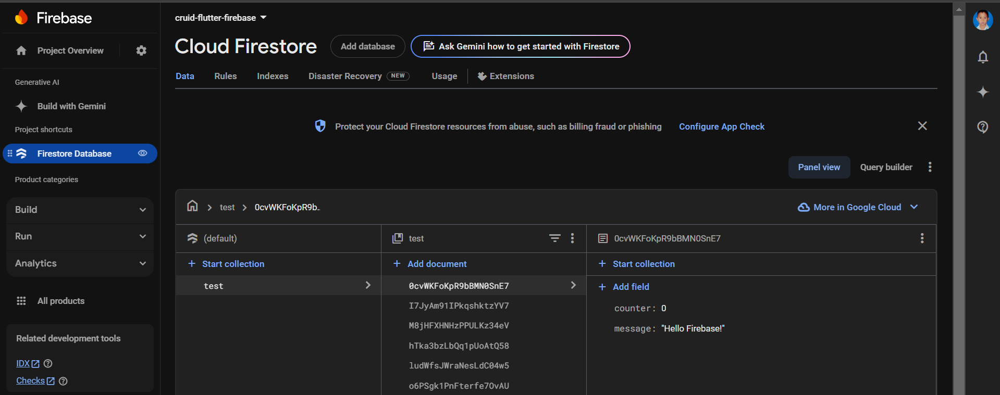

# MEMBUAT `SISTEM CRUID DI FLUTTER DAN FIREBASE` MUNGKIN ADA BEBERAPA SERIES DITUNGGU UPDATE NYA🏃🏻‍➡️😃

# 01.PENGECEKAN SOFTWARE" `FLUTTER`, `FIREBASE`, `FLUTTERFIRE`.
**CEK SDK FLUTTER**
```BASH
flutter --version
```
**CEK FIREBASE**
```BASH
firebase --version
```

**CEK FLUTTERFIRE**
```BASH
flutterfire --version
```

**PASTIKAN SEMUA ITU MENGEMBALIKAN VERSINYA DAN LANJUTKAN KE SELANJUTNYA.**
<div align="center">
     
</div>

# 02.MEMBUAT DATABASE DI CONSOLE FIREBASE
<div align="center">
     
</div>

# 03.MASUK KE VSCode
**BUAT NEW FLUTTER**<br>
**Dengan shortcut keyboard `Ctrl` **+** `Shift` **+** `p`**

**BUKA CMD/POWERSHELL DIPROJECT ITU BERADA DENGAN `Ctrl` **+** `~`**
```BASH
dart pub global activate flutterfire_cli
```

**DAN CONFIGURE**
```BASH
flutterfire configure
```

**DAN PILIH SEPERLUNYA `EXAMPLE`**<br>
# [<kbd>VIDEO FULL SETUP DI Visual Studio Code</kbd>](https://drive.google.com/file/d/1omcz5Auao_ZXx0vN1D3_kMdM9Ysjb9pX/view)


# 04.NGODING TIPIS-TIPIS DENGAN CODE DI PATH `lib`**/**`main.dart`
```CODINGAN
import 'package:flutter/material.dart';
import 'package:firebase_core/firebase_core.dart';
import 'package:cloud_firestore/cloud_firestore.dart';
import 'firebase_options.dart';

void main() async {
  WidgetsFlutterBinding
      .ensureInitialized(); // Diperlukan sebelum panggilan Firebase.initializeApp
  await Firebase.initializeApp(
    options: DefaultFirebaseOptions.currentPlatform,
  );
  runApp(const MyApp());
}

class MyApp extends StatelessWidget {
  const MyApp({super.key});

  @override
  Widget build(BuildContext context) {
    return MaterialApp(
      title: 'Flutter Demo',
      theme: ThemeData(
        colorScheme: ColorScheme.fromSeed(seedColor: Colors.deepPurple),
        useMaterial3: true,
      ),
      home: const MyHomePage(title: 'Flutter Firebase Demo'),
    );
  }
}

class MyHomePage extends StatefulWidget {
  const MyHomePage({super.key, required this.title});

  final String title;

  @override
  State<MyHomePage> createState() => _MyHomePageState();
}

class _MyHomePageState extends State<MyHomePage> {
  int _counter = 0;

  // Inisialisasi Firestore
  final FirebaseFirestore firestore = FirebaseFirestore.instance;

  void _incrementCounter() {
    setState(() {
      _counter++;
    });
  }

  // Fungsi untuk menambahkan data ke Firestore
  void _addFirestoreData() {
    firestore
        .collection('test')
        .add({'message': 'Hello Firebase!', 'counter': _counter}).then((value) {
      ScaffoldMessenger.of(context).showSnackBar(
        const SnackBar(content: Text('Data added to Firestore!')),
      );
    }).catchError((error) {
      ScaffoldMessenger.of(context).showSnackBar(
        SnackBar(content: Text('Failed to add data: $error')),
      );
    });
  }

  @override
  Widget build(BuildContext context) {
    return Scaffold(
      appBar: AppBar(
        backgroundColor: Theme.of(context).colorScheme.inversePrimary,
        title: Text(widget.title),
      ),
      body: Center(
        child: Column(
          mainAxisAlignment: MainAxisAlignment.center,
          children: <Widget>[
            const Text('You have pushed the button this many times:'),
            Text(
              '$_counter',
              style: Theme.of(context).textTheme.headlineMedium,
            ),
            const SizedBox(height: 20),
            ElevatedButton(
              onPressed:
                  _addFirestoreData, // Panggil fungsi untuk menyimpan data ke Firestore
              child: const Text('Test Firestore'),
            ),
          ],
        ),
      ),
      floatingActionButton: FloatingActionButton(
        onPressed: _incrementCounter,
        tooltip: 'Increment',
        child: const Icon(Icons.add),
      ),
    );
  }
}
```
# 05.DAN JUGA JANGAN LUPA MENAMBAHKAN DEPENDENSI DI PATH `pubspec.yaml`
```EXAMPLE
dependencies:
  flutter:
    sdk: flutter

  # The following adds the Cupertino Icons font to your application.
  # Use with the CupertinoIcons class for iOS style icons.
  cupertino_icons: ^1.0.8
  firebase_core: ^2.18.0
  cloud_firestore: ^4.17.5
```

# 06.RUNNING SISTEM
**MENGUNDUH DEPENDENSINYA DULU**
```BASH
flutter pub get
```

**MERUNINGNNYA**
```BASH
flutter run
```

**dan hasilnya setelah menekan button `TEST FIRESTRORE`**
<div align="center">
     
</div>

# 07.SELESAI SUDAH SERIES INI YAITU TENTANG `CONNECT FLUTTER KE FIREBASE`

# [<kbd style="font-size: 50px; padding: 20px 25px;">PART 2️⃣</kbd>](https://github.com/TEUNGKU-ZULKIFLI/PROJECT-FLUTTER/blob/master/002.CRUID_FLUTTER_FIREBASE.md)