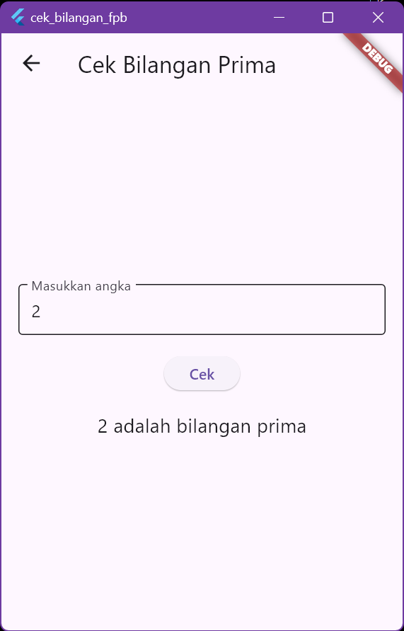

# Daftar Project Flutter

Berikut adalah beberapa project Flutter yang telah saya bangun. Klik tautan di bawah untuk mengakses repositori project tersebut.

---

## Project 1: Cek Bilangan Prima & FPB
Sedikit deskripsi: Aplikasi ini digunakan untuk menghitung bilangan prima dan mencari faktor persekutuan terbesar (FPB).

[<kbd>REPO PROJECT 1</kbd>](https://github.com/username/project1)

---

## Project 2: Learn
Sedikit deskripsi: Aplikasi pembelajaran sederhana untuk memahami konsep Flutter.

[<kbd>REPO PROJECT 2</kbd>](https://github.com/username/project1)

---

## Project 3: Double Tap
Sedikit deskripsi: Aplikasi yang menunjukkan cara menangani gesture double tap pada Flutter.

[<kbd>REPO PROJECT 3</kbd>](https://github.com/username/project1)

---

## Project 4: Alert Dialog
Sedikit deskripsi: Aplikasi untuk menampilkan contoh penggunaan Alert Dialog di Flutter.

[<kbd>REPO PROJECT 4</kbd>](https://github.com/username/project1)

---

## Project 5: Show Image
Sedikit deskripsi: Aplikasi yang menampilkan gambar dengan berbagai format di Flutter.

[<kbd>REPO PROJECT 5</kbd>](https://github.com/username/project1)

---

## Project 6: Tab View
Sedikit deskripsi: Implementasi tab view di Flutter untuk navigasi yang lebih mudah.

[<kbd>REPO PROJECT 6</kbd>](https://github.com/username/project1)

---

## Project 7: Tab Bottom
Sedikit deskripsi: Menambahkan navigasi bottom tab ke aplikasi Flutter.

[<kbd>REPO PROJECT 7</kbd>](https://github.com/username/project1)

---

## Project 8: Drawer
Sedikit deskripsi: Contoh penggunaan drawer menu di Flutter.

[<kbd>REPO PROJECT 8</kbd>](https://github.com/username/project1)

---

## Project 9: Menu Row
Sedikit deskripsi: Aplikasi yang menggunakan row untuk menampilkan menu horizontal.

[<kbd>REPO PROJECT 9</kbd>](https://github.com/username/project1)

---

## Project 10: Stepper
Sedikit deskripsi: Implementasi widget stepper di Flutter.

[<kbd>REPO PROJECT 10</kbd>](https://github.com/username/project1)

---

## Project 11: Circular
Sedikit deskripsi: Menampilkan progress bar circular dengan animasi di Flutter.

[<kbd>REPO PROJECT 11</kbd>](https://github.com/username/project1)

---

## Project 12: Date Picker
Sedikit deskripsi: Aplikasi yang menampilkan fitur pemilihan tanggal dengan Date Picker.

[<kbd>REPO PROJECT 12</kbd>](https://github.com/username/project1)

---

## Project 13: Data Table
Sedikit deskripsi: Menampilkan data dalam bentuk tabel dengan sorting dan filtering.

[<kbd>REPO PROJECT 13</kbd>](https://github.com/username/project1)

---

## Project 14: Grid View
Sedikit deskripsi: Implementasi GridView untuk menampilkan data dalam grid di Flutter.

[<kbd>REPO PROJECT 14</kbd>](https://github.com/username/project1)

---

## Project 15: Indexed Stack
Sedikit deskripsi: Contoh penggunaan Indexed Stack di Flutter untuk menumpuk widget.

[<kbd>REPO PROJECT 15</kbd>](https://github.com/username/project1)

---

## Project 16: CRUD
Sedikit deskripsi: Aplikasi CRUD (Create, Read, Update, Delete) sederhana di Flutter.

[<kbd>REPO PROJECT 16</kbd>](https://github.com/username/project1)

---

## Project 17: REST API
Sedikit deskripsi: Implementasi REST API di Flutter untuk mengambil dan menampilkan data.

[<kbd>REPO PROJECT 17</kbd>](https://github.com/username/project1)
