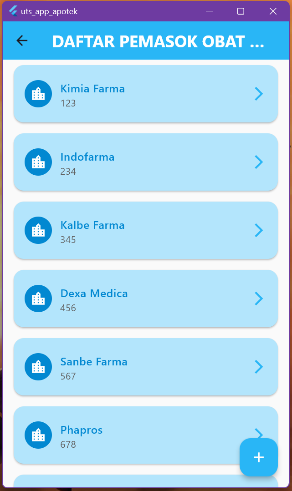
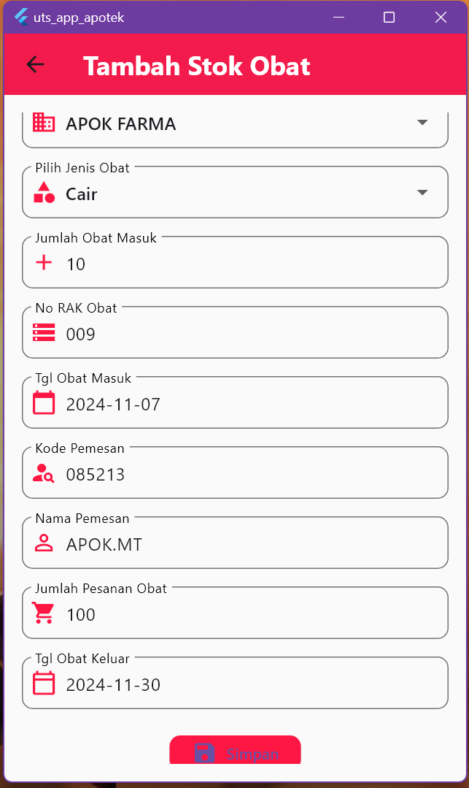

# Daftar Project Flutter

## Berikut adalah beberapa project Flutter yang telah saya bangun. Klik tautan di bawah untuk mengakses repositori project tersebut.

---

# 🙏 Ucapan Terima Kasih kepada Yang Bersangkutan 🙂

  <a href="https://juragankoding.com/"><button style="font-size: 18px; padding: 10px 20px; background-color: #007BFF; color: white; border: none; border-radius: 5px; cursor: pointer;">JURAGAN KODING</button></a>
  <a href="https://www.konsepkoding.com/"><button style="font-size: 18px; padding: 10px 20px; background-color: #007BFF; color: white; border: none; border-radius: 5px; cursor: pointer;">KONSEP KODING</button></a>
  <a href="https://medium.com/@coderjava"><button style="font-size: 18px; padding: 10px 20px; background-color: #007BFF; color: white; border: none; border-radius: 5px; cursor: pointer;">CODER JAVA</button></a>
  <a href="https://www.youtube.com/@CodeXdev"><button style="font-size: 18px; padding: 10px 20px; background-color: #007BFF; color: white; border: none; border-radius: 5px; cursor: pointer;">CodeXdev</button></a>

## Dan lainnya yang terkait 😊

---

# Project 1: Cek Bilangan Prima & FPB
**Sedikit deskripsi:** Aplikasi ini digunakan untuk menghitung bilangan prima dan mencari faktor persekutuan terbesar (FPB).

  
  
  

  <a href="https://github.com/TEUNGKU-ZULKIFLI/1.app_cek_bilangan_prima_dan_fpb"><button style="font-size: 18px; padding: 10px 20px; background-color: #28a745; color: white; border: none; border-radius: 5px; cursor: pointer;">REPO PROJECT 1</button></a>

---

# Project 2: Learn
**Sedikit deskripsi:** Aplikasi pembelajaran sederhana untuk memahami konsep Flutter.

  
  

  <a href="https://github.com/TEUNGKU-ZULKIFLI/2.learn"><button style="font-size: 18px; padding: 10px 20px; background-color: #28a745; color: white; border: none; border-radius: 5px; cursor: pointer;">REPO PROJECT 2</button></a>

---

# Project 3: Double Tap
**Sedikit deskripsi:** Aplikasi yang menunjukkan cara menangani gesture double tap pada Flutter.

  
  

  <a href="https://github.com/TEUNGKU-ZULKIFLI/3.double_tap"><button style="font-size: 18px; padding: 10px 20px; background-color: #28a745; color: white; border: none; border-radius: 5px; cursor: pointer;">REPO PROJECT 3</button></a>

---

# Project 4: Alert Dialog
**Sedikit deskripsi:** Aplikasi untuk menampilkan contoh penggunaan Alert Dialog di Flutter.

  
  

  <a href="https://github.com/TEUNGKU-ZULKIFLI/4.alert_dialog"><button style="font-size: 18px; padding: 10px 20px; background-color: #28a745; color: white; border: none; border-radius: 5px; cursor: pointer;">REPO PROJECT 4</button></a>

---

# Project 5: Show Image
**Sedikit deskripsi:** Aplikasi yang menampilkan gambar dengan berbagai format di Flutter.

  
  

  <a href="https://github.com/TEUNGKU-ZULKIFLI/5.show_image"><button style="font-size: 18px; padding: 10px 20px; background-color: #28a745; color: white; border: none; border-radius: 5px; cursor: pointer;">REPO PROJECT 5</button></a>

---

# Project 6: Tab View
**Sedikit deskripsi:** Implementasi tab view di Flutter untuk navigasi yang lebih mudah.

  
  
  

  <a href="https://github.com/TEUNGKU-ZULKIFLI/6.tab_view"><button style="font-size: 18px; padding: 10px 20px; background-color: #28a745; color: white; border: none; border-radius: 5px; cursor: pointer;">REPO PROJECT 6</button></a>

---

# Project 7: Tab Bottom
**Sedikit deskripsi:** Menambahkan navigasi bottom tab ke aplikasi Flutter.

  

  <a href="https://github.com/TEUNGKU-ZULKIFLI/7.tab_bottom"><button style="font-size: 18px; padding: 10px 20px; background-color: #28a745; color: white; border: none; border-radius: 5px; cursor: pointer;">REPO PROJECT 7</button></a>

---

# Project 8: Drawer
**Sedikit deskripsi:** Contoh penggunaan drawer menu di Flutter.

  
  

  <a href="https://github.com/TEUNGKU-ZULKIFLI/8.drawer"><button style="font-size: 18px; padding: 10px 20px; background-color: #28a745; color: white; border: none; border-radius: 5px; cursor: pointer;">REPO PROJECT 8</button></a>

---

# Project 9: Menu Row
**Sedikit deskripsi:** Aplikasi yang menggunakan row untuk menampilkan menu horizontal.

  

  <a href="https://github.com/TEUNGKU-ZULKIFLI/9.menu_row"><button style="font-size: 18px; padding: 10px 20px; background-color: #28a745; color: white; border: none; border-radius: 5px; cursor: pointer;">REPO PROJECT 9</button></a>

---

# Project 10: Stepper
**Sedikit deskripsi:** Implementasi widget stepper di Flutter.

  
  
  
  

  <a href="https://github.com/TEUNGKU-ZULKIFLI/10.stepper"><button style="font-size: 18px; padding: 10px 20px; background-color: #28a745; color: white; border: none; border-radius: 5px; cursor: pointer;">REPO PROJECT 10</button></a>

---

# Project 11: Circular
**Sedikit deskripsi:** Menampilkan progress bar circular dengan animasi di Flutter.

  

  <a href="https://github.com/TEUNGKU-ZULKIFLI/11.circular"><button style="font-size: 18px; padding: 10px 20px; background-color: #28a745; color: white; border: none; border-radius: 5px; cursor: pointer;">REPO PROJECT 11</button></a>

---

# Project 12: Date Picker
**Sedikit deskripsi:** Aplikasi yang menggunakan date picker di Flutter.

  
  
  

  <a href="https://github.com/TEUNGKU-ZULKIFLI/12.date_picker"><button style="font-size: 18px; padding: 10px 20px; background-color: #28a745; color: white; border: none; border-radius: 5px; cursor: pointer;">REPO PROJECT 12</button></a>

---

# Project 13: Data Table
**Sedikit deskripsi:** Implementasi table data di Flutter.

  

  <a href="https://github.com/TEUNGKU-ZULKIFLI/13.data_table"><button style="font-size: 18px; padding: 10px 20px; background-color: #28a745; color: white; border: none; border-radius: 5px; cursor: pointer;">REPO PROJECT 13</button></a>

---

# Project 14: Grid View
**Sedikit deskripsi:** Aplikasi untuk menampilkan grid view di Flutter.

  

  <a href="https://github.com/TEUNGKU-ZULKIFLI/14.grid_view"><button style="font-size: 18px; padding: 10px 20px; background-color: #28a745; color: white; border: none; border-radius: 5px; cursor: pointer;">REPO PROJECT 14</button></a>

---

# Project 15: Indexed Stack
**Sedikit deskripsi:** Menggunakan widget IndexedStack untuk mengatur tampilan di Flutter.

  
  
  
  
  
  
  
  
  

  <a href="https://github.com/TEUNGKU-ZULKIFLI/15.indexed_stack"><button style="font-size: 18px; padding: 10px 20px; background-color: #28a745; color: white; border: none; border-radius: 5px; cursor: pointer;">REPO PROJECT 15</button></a>

---

# Project 16: CRUD
**Sedikit deskripsi:** Project yang menerapkan operasi CRUD sederhana menggunakan Flutter dan SQLite.

  
  
  
  
  
  

  <a href="https://github.com/TEUNGKU-ZULKIFLI/16.crud"><button style="font-size: 18px; padding: 10px 20px; background-color: #28a745; color: white; border: none; border-radius: 5px; cursor: pointer;">REPO PROJECT 16</button></a>

---

# Project 17: REST API
**Sedikit deskripsi:** Implementasi REST API di Flutter untuk menghubungkan aplikasi dengan server backend.

  
  
  

  <a href="https://github.com/TEUNGKU-ZULKIFLI/17.rest_api"><button style="font-size: 18px; padding: 10px 20px; background-color: #28a745; color: white; border: none; border-radius: 5px; cursor: pointer;">REPO PROJECT 17</button></a>

---

# Project 18: APP APOTEK
**Sedikit deskripsi:** Memudahkan kamu seorang doctor, suster, perawat, atau bahkan pasien sekalipun. Gak-gak yang terakhir bercanda 🤣. Dalam memanajemen Data entah itu data obat, data staf di APOTEK🏥 tersebut, bahkan data pasien, bukan mayat ya PASIEN 🤣🤣 tapi kalau calon mayat ya masuk sih.

    
    
    
    
    
    
    
    
    
    
    
    
    
    
    
    

---

**Ini ialah versi penambahan fitur:** Ini memungkinkan kamu menambahkan perusahaan mana sih yang mau menyetok obat/memasok obat, serta memungkinkan kamu untuk memonitoringnya data masuk dan data keluar, ya iyalah masak uang masuk aja kamu datain 🤣. serta menambahkan fitur pencarian, untuk menyelesaikan masalah, itu obat sakit perut masih berapa stok lagi dah 🤔. nah begitu lah kira" penambahan fiturnya ada 3.

    
    
    
    
    
    
    
    
    
    
    

  <a href="https://github.com/TEUNGKU-ZULKIFLI/18.uts_app_apotek"><button style="font-size: 18px; padding: 10px 20px; background-color: #28a745; color: white; border: none; border-radius: 5px; cursor: pointer;">REPO PROJECT 18</button></a>

---